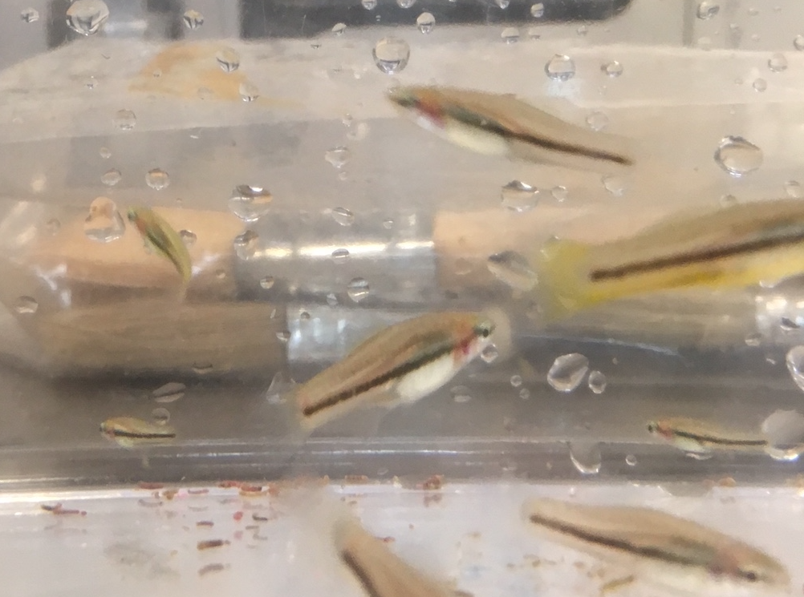
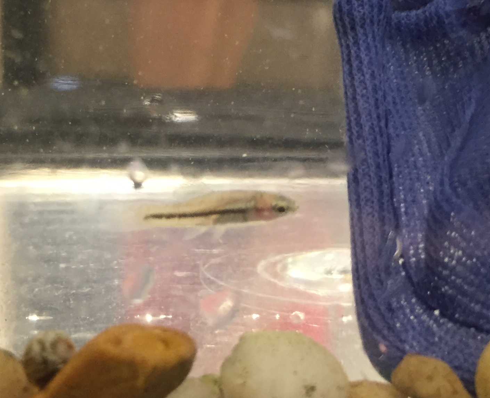
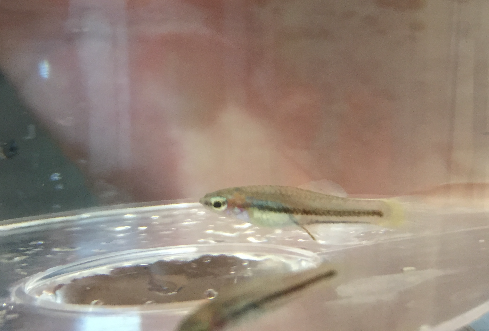

# spot that male! 

Each photo contains a small male. Use this guide to develop an intuition about what a developing small male looks like.

Things to look for:    
- yellowness, espeically at the base of the caudal fin
- thin body shape
- elongating anal fish 

Here we go:

This isn't a direct photo of the male, but notice on the right a fish with yellow on its tail. This fish will almost certainly develop into a male. Yellowness is a Y-linked trait. Small males can be either XY or XX, so yellowness isn't a perfect diagnositc, but if you see yellow like in the photo you know it's a male.

It's a little hard to see in this photo, but this developing male is a little yellow and he has a longer, thin body shape

If you look carefully at this photo, you'll notice that this male's anal fin is not completely spread out like a fan, but is starting to become elongated.
